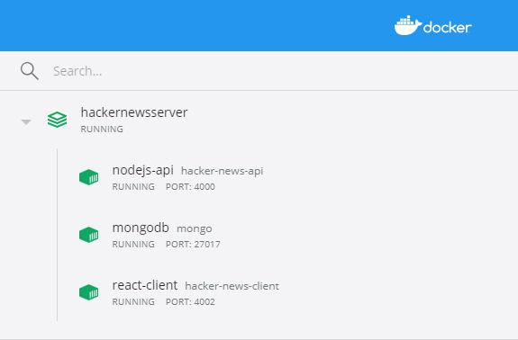
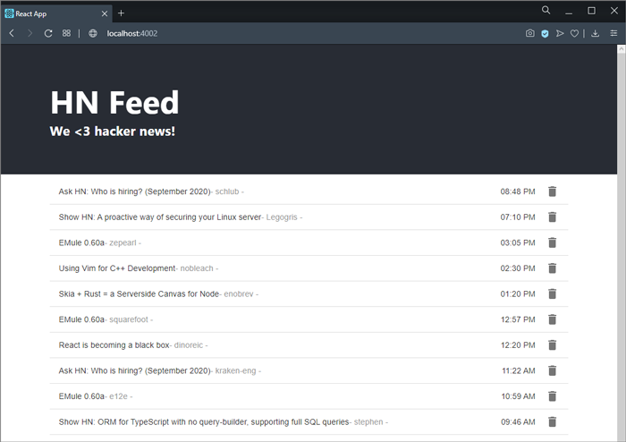

# Hacker News App

### About

This app shows you the posts of a hacker's news site. Every hour a feed of 20 posts is imported to our database. You can see the list on the app, as well as delete items locally.
There are two components:

- The Client which serves the FrontEnd (using React) .
- The API (in Node/Express/MongoDB).

### Where can I check the app?

You are very welcome to check the React client hosted on my Azure Docker Container. Just follow the link below.

- [Hacker news feed using React with Material UI](http://luissanchez-hacker-news-client.eastus2.azurecontainer.io)

You can also check the API hosted on my Heroku personal cloud. It uses a MongoDB dabatase hosted on my Atlas Mongo account (connection string was set via environment variable on Heroku, so don't worry, you won't find my user and password on the repository :) ).

- [Careful, you might find a 404 error by going to the wrong URL](https://hacker-news-nodejs-api.herokuapp.com/)

# Clone and run the app using Docker Compose

1. Open your terminal and type:

```
git clone https://gitlab.com/luissanchezm86/HackerNewsServer.git
```

2. Navigate to the root directory: `HackerNewsServer`
3. Run the following command:

```
docker-compose up
```

4. Wait a few moments and your containers should be running.



### Lets see the app

1. Open your browser and go to http://localhost:4002/
2. You should now see the first 20 hits in descending posted order!



### Important notes

1. If the database is empty, it will automatically feed it with the hn-API.
2. First load might be slow, but don't worry!
3. Be aware, if you delete all your hit's feed and there is no more data on the db collection, you won't see more posts since you cannot see what you have deleted.
4. If you want to see all the feed again, just open the console in your browser and delete your local storage.

### You can also get the docker images of each component on my [DockerHub](https://hub.docker.com/u/luissanchezm86)

1. [Hacker-news-API with local mongoDB](https://hub.docker.com/r/luissanchezm86/hacker-news-api)
2. [Hacker-news-Client](https://hub.docker.com/r/luissanchezm86/hacker-news-client)

##### If you want too run each component locally, there is a readme on each of directory with more details!
